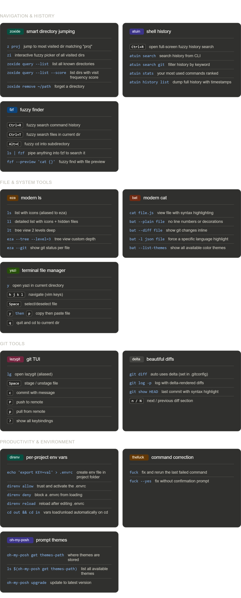

# WSL2 Bash Power Tools — Cheatsheet by Aleksandar Perisic 

## Navigation & History

### zoxide — smart directory jumping
| Command | Description |
|---|---|
| `z proj` | jump to most visited dir matching "proj" |
| `zi` | interactive fuzzy picker of all visited dirs |
| `zoxide query --list` | list all known directories |
| `zoxide query --list --score` | list dirs with visit frequency score |
| `zoxide remove ~/path` | forget a directory |

### atuin — shell history
| Command | Description |
|---|---|
| `Ctrl+R` | open full-screen fuzzy history search |
| `atuin search` | search history from CLI |
| `atuin search git` | filter history by keyword |
| `atuin stats` | your most used commands ranked |
| `atuin history list` | dump full history with timestamps |

### fzf — fuzzy finder
| Command | Description |
|---|---|
| `Ctrl+R` | fuzzy search command history |
| `Ctrl+T` | fuzzy search files in current dir |
| `Alt+C` | fuzzy cd into subdirectory |
| `ls \| fzf` | pipe anything into fzf to search it |
| `fzf --preview 'cat {}'` | fuzzy find with file preview |

---

## File & System Tools

### eza — modern ls
| Command | Description |
|---|---|
| `ls` | list with icons (aliased to eza) |
| `ll` | detailed list with icons + hidden files |
| `lt` | tree view 2 levels deep |
| `eza --tree --level=3` | tree view custom depth |
| `eza --git` | show git status per file |

### bat — modern cat
| Command | Description |
|---|---|
| `cat file.js` | view file with syntax highlighting |
| `bat --plain file` | no line numbers or decorations |
| `bat --diff file` | show git changes inline |
| `bat -l json file` | force a specific language highlight |
| `bat --list-themes` | show all available color themes |

### yazi — terminal file manager
| Command | Description |
|---|---|
| `y` | open yazi in current directory |
| `h j k l` | navigate (vim keys) |
| `Space` | select/deselect file |
| `y` then `p` | copy then paste file |
| `q` | quit and cd to current dir |

---

## Git Tools

### lazygit — git TUI
| Command | Description |
|---|---|
| `lg` | open lazygit (aliased) |
| `Space` | stage / unstage file |
| `c` | commit with message |
| `P` | push to remote |
| `p` | pull from remote |
| `?` | show all keybindings |

### delta — beautiful diffs
| Command | Description |
|---|---|
| `git diff` | auto uses delta (set in .gitconfig) |
| `git log -p` | log with delta-rendered diffs |
| `git show HEAD` | last commit with syntax highlight |
| `n / N` | next / previous diff section |

---

## Productivity & Environment

### direnv — per-project env vars
| Command | Description |
|---|---|
| `echo 'export KEY=val' > .envrc` | create env file in project folder |
| `direnv allow` | trust and activate the .envrc |
| `direnv deny` | block a .envrc from loading |
| `direnv reload` | reload after editing .envrc |
| `cd out && cd in` | vars load/unload automatically on cd |

### thefuck — command correction
| Command | Description |
|---|---|
| `fuck` | fix and rerun the last failed command |
| `fuck --yes` | fix without confirmation prompt |

### oh-my-posh — prompt themes
| Command | Description |
|---|---|
| `oh-my-posh get themes-path` | where themes are stored |
| `ls $(oh-my-posh get themes-path)` | list all available themes |
| `oh-my-posh upgrade` | update to latest version |

---

## ~/.bashrc Reference

```bash
# Oh My Posh
eval "$(oh-my-posh init bash --config $(oh-my-posh get themes-path)/jandedobbeleer.omp.json)"

# zoxide
eval "$(zoxide init bash)"

# direnv
eval "$(direnv hook bash)"

# atuin
export PATH="$HOME/.atuin/bin:$PATH"
eval "$(atuin init bash)"

# thefuck
eval "$(thefuck --alias)"

# fzf key-bindings
source /usr/share/doc/fzf/examples/key-bindings.bash

# aliases
alias ls='eza --icons --group-directories-first'
alias ll='eza --icons --group-directories-first -la'
alias lt='eza --icons --tree --level=2'
alias cat='bat'
alias lg='lazygit'
```

---

## Tips

- `zi` is the fastest way to jump around once zoxide has learned your habits — use it over `cd`
- `lg` replaces most day-to-day git commands — press `?` inside for all keybindings
- Put `ANTHROPIC_API_KEY` in a `.envrc` at your project root — direnv loads/unloads it automatically
- Keep project files under `~/` not `/mnt/c/` — git operations across the Windows filesystem boundary are slow


